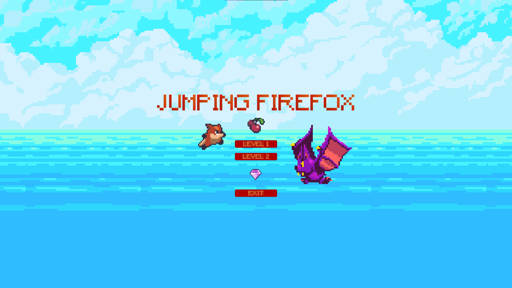
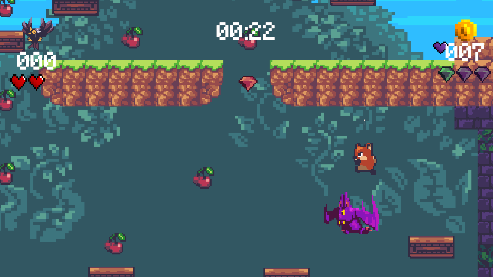
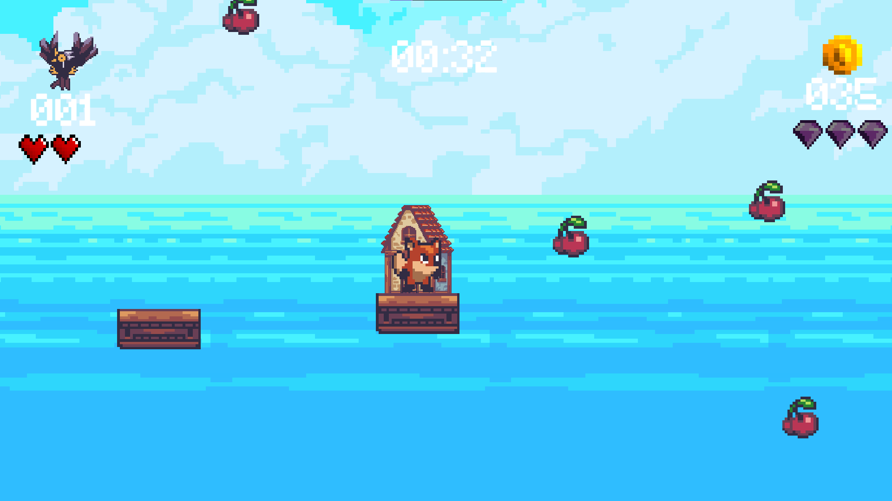

# 🦊 Jumping Firefox

> Simple 2D Platformer game written in **C#** using **Unity**

---

## 🎮 Gameplay Preview

> _Below: screenshots from the game_

---

## 🔎 Features

- ⚙️ **Multiple levels**: player can choose one of two designed levels
- 🎯 **Score system**: earn points for collecting cherries and  defeating enemies
- 💎 **Key system**: collect all gems and reach finish point to pass the level
- 🏃 **Advanced movement**: dynamic movement combined with _Dash_ and _Double Jump_ mechanics for smooth gameplay

---

## 🧪 Technologies

- **Language:** C#
- **Engine:** Unity 
  _`Unity` is a powerful game engine for creating 2D and 3D games._

---

## 🎮 Controls

| Key              | Action      |
|------------------|-------------|
| ⬅️ A             | Move Left   |
| ➡️ D             | Move Right  |
| ⬆️ Space         | Jump        |
| 💨 Ctrl          | Dash        |
| ⚙️ Esc           | Options     |

---

## 🛠️ Used Assets

- **Sunny Land**
- **2D Pixel Item Asset Pack**
- **True 8-bit Sound Effect Collection - Lite version**
- **Pixel Font - Tripfive**
